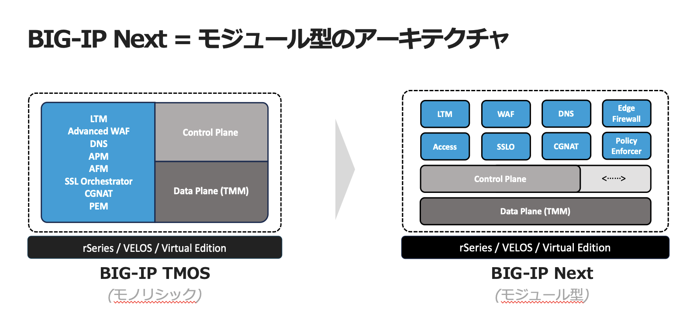

新しいBIG-IPソフトウェア　"BIG-IP Next"とは？
======================================

F5は、2023年に、次世代アーキテクチャーを採用したソフトウェア”BIG-IP NEXT”（バージョンである20.0〜）をリリースしました。クラウドシフトやコンテナ、DevOpsなどのアプリケーションの変化に対応し最適な通信環境を提供するため、従来のTMOSをベースとし新しくコンテナ・マイクロサービスで動作するソフトウェアへと進化しました。これにより、コントロールプレーンとデータプレーンの分離、通信状況に応じた柔軟なスケールアウトの実現など、現在およびこれからのアプリケーション基盤に最適なネットワークやセキュリティを提供します。

BIG-IP NextのモダンかつAPIを中核としたソフトウェア・アーキテクチャがもたらす価値
- 運用の複雑さを軽減
- 自動化により最適化
- セキュリティ向上とリスク軽減
- パフォーマンスと拡張性を向上
- 可観測性の向上
- BIG-IP TMOSの中核となる機能を保持

