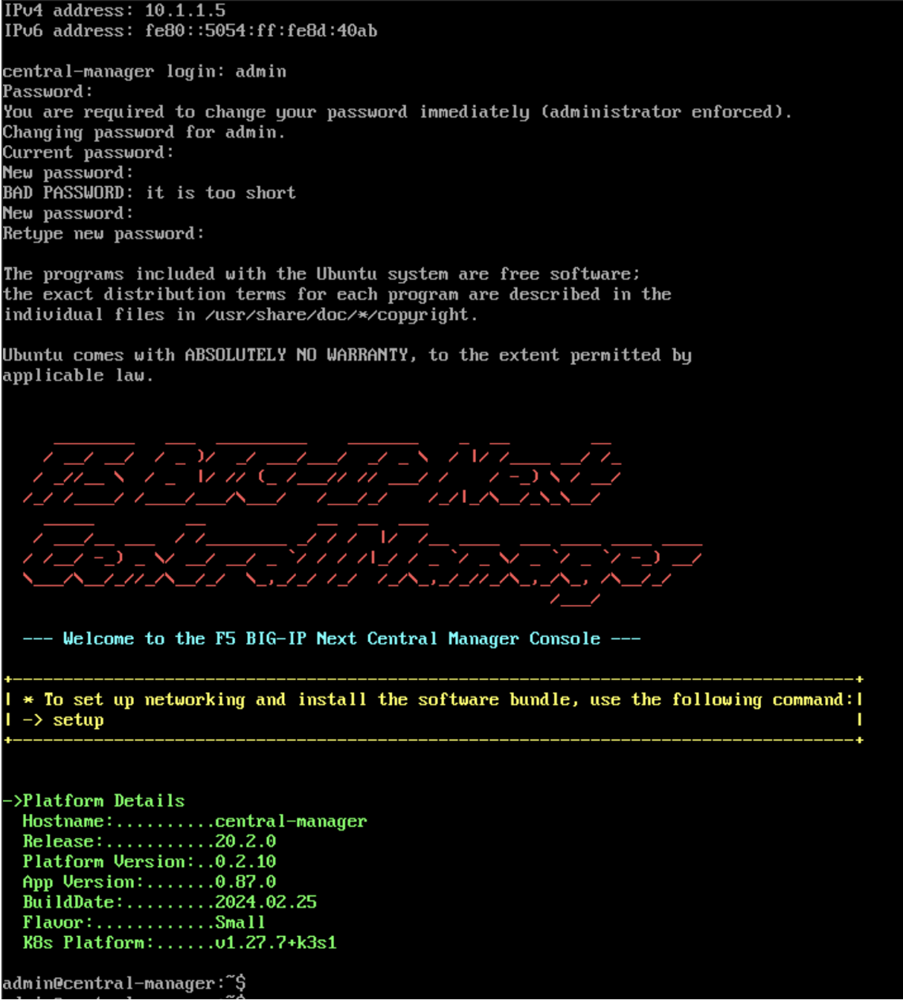

BIG-IP Next CMへのアクセス
======================================

UDF環境からCM Consoleへのアクセス方法
--------------------------------------

UDF画面上部タブの"DEPLOYMENT"をクリックし、BIG-IP Next Central Managerインスタンスの"ACCESS" > "CONSOLE" を選択します。

.. figure:: images/c3-m2-1.png
   :scale: 50%
   :align: center

BIG-IP Next CM CLIへのログイン
--------------------------------------

ログインプロンプトが表示されたら、初期パスワードを入力します。

- 初期ユーザー名/パスワード:
   - **admin/admin**

- "New Password"の入力:
   - **Welcome123!**
  を新パスワードとして設定します。（任意のパスワードでOK）

パスワード設定完了すると、以下画面のようにロゴが表示されCLIにログインします。

