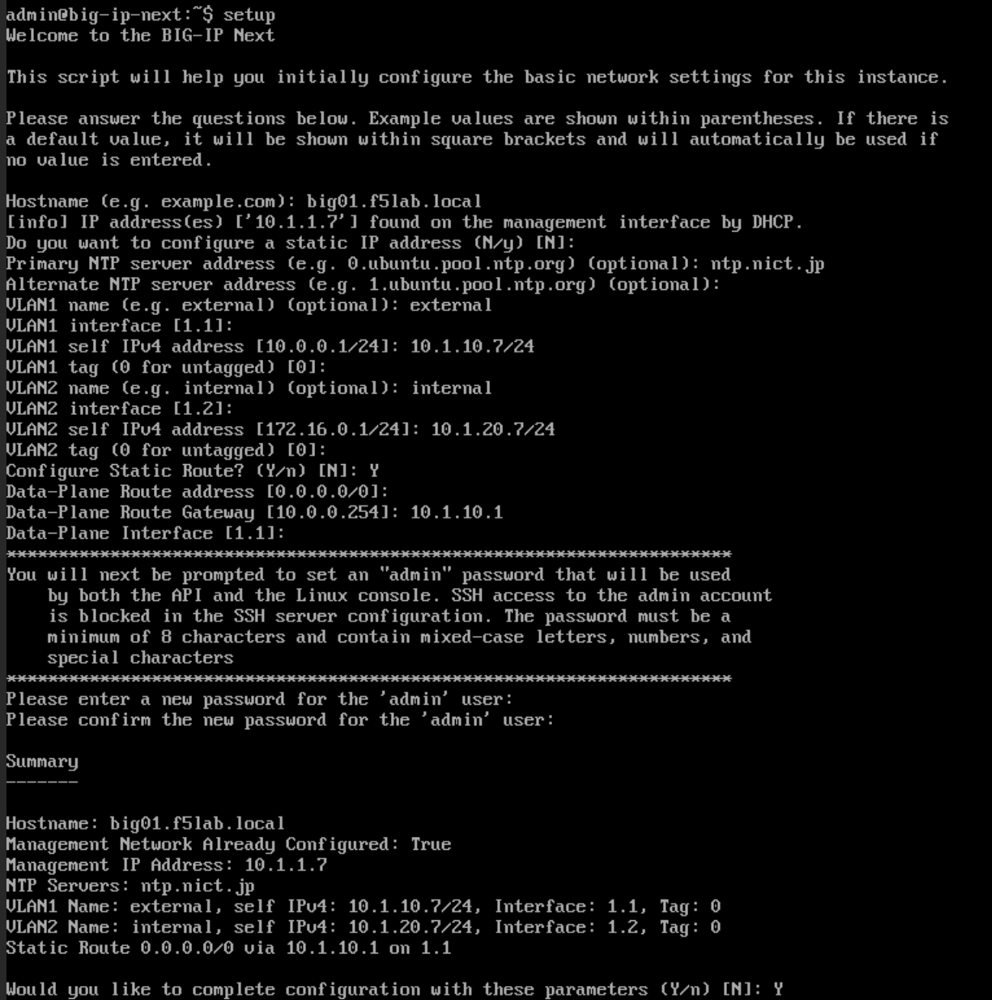

BIG-IP Next の初期セットアップ
======================================

Instance1 初期設定コマンドの実行
--------------------------------------

- BIG-IP Next Instance1 にログイン、**"setup"** コマンドを実行し、ホスト名、Mgmt IP、VLAN、Self IP等の設定を行います。

- Hostname:
   - **big01.f5lab.local**
- IP Address:
   - **設定済み**
- Primary NTP server address: 
   - **ntp.nict.jp**
- VLAN1 name: 
   - **external**
- VLAN1 interface: 
   - **1.1 (Enter)**
- VLAN1 self IPv4 address: 
   - **10.1.10.7/24**
- VLAN1 tag: 
   - **0 (Enter)**
- VLAN2 name: 
   - **internal**
- VLAN2 interface: 
   - **1.2 (Enter)**
- VLAN2 self IPv4 address: 
   - **10.1.20.7/24**
- VLAN2 tag: 
   - **0 (Enter)**
- Configure Static Route?: 
   - **Y**
- Data-Plane Route address: 
   - **0.0.0.0/0 (Enter)**
- Data-Plane Route Gateway: 
   - **10.1.10.1**
- Data-Plane Interface: 
   - **1.1 (Enter)**
- Please enter a new password ここでadminのパスワード変更を実施: 
   - **Welcome123! (任意のパスワードでOK)**
- Summaryを確認してy(yes)でEnter

Instance2 初期設定コマンドの実行
--------------------------------------

- 同様にBIG-IP Next Instance2 側でも設定を行います。

- Hostname:
   - **big02.f5lab.local**
- IP Address:
   - **設定済み**
- Primary NTP server address: 
   - **ntp.nict.jp**
- VLAN1 name: 
   - **external**
- VLAN1 interface: 
   - **1.1 (Enter)**
- VLAN1 self IPv4 address: 
   - **10.1.10.8/24**
- VLAN1 tag: 
   - **0 (Enter)**
- VLAN2 name: 
   - **internal**
- VLAN2 interface: 
   - **1.2 (Enter)**
- VLAN2 self IPv4 address: 
   - **10.1.20.8/24**
- VLAN2 tag: 
   - **0 (Enter)**
- Configure Static Route?: 
   - **Y**
- Data-Plane Route address: 
   - **0.0.0.0/0 (Enter)**
- Data-Plane Route Gateway: 
   - **10.1.10.1**
- Data-Plane Interface: 
   - **1.1 (Enter)**
- Please enter a new password ここでadminのパスワード変更を実施: 
   - **Welcome123! (任意のパスワードでOK)**
- Summaryを確認してy(yes)でEnter
