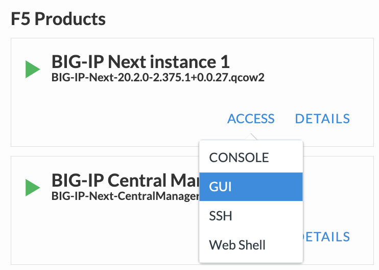
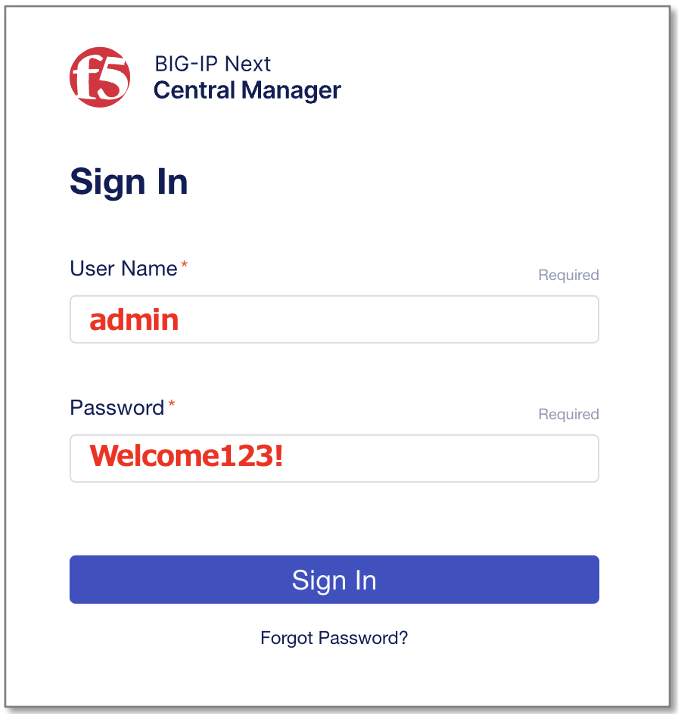
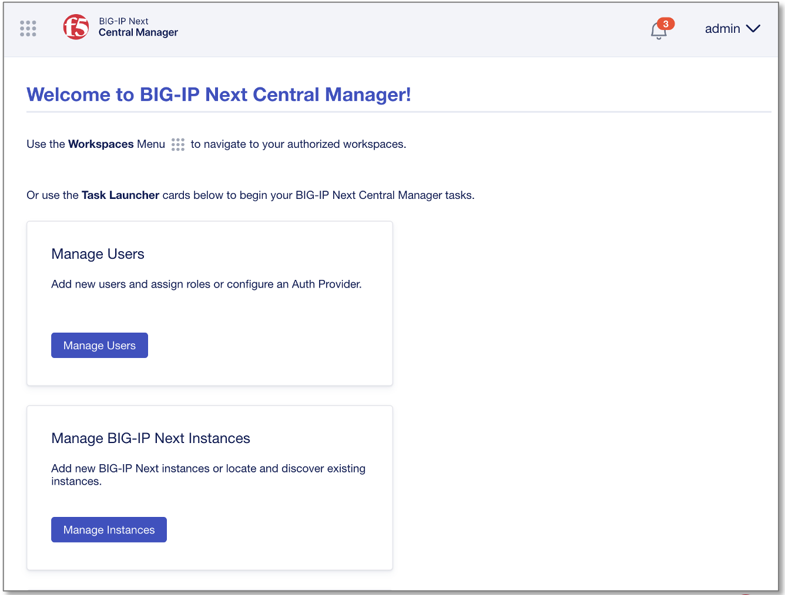
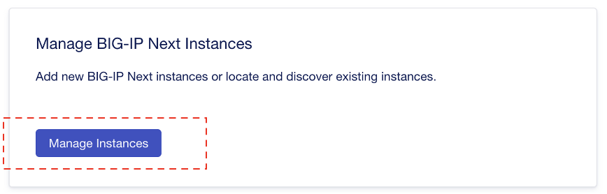
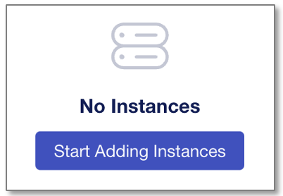
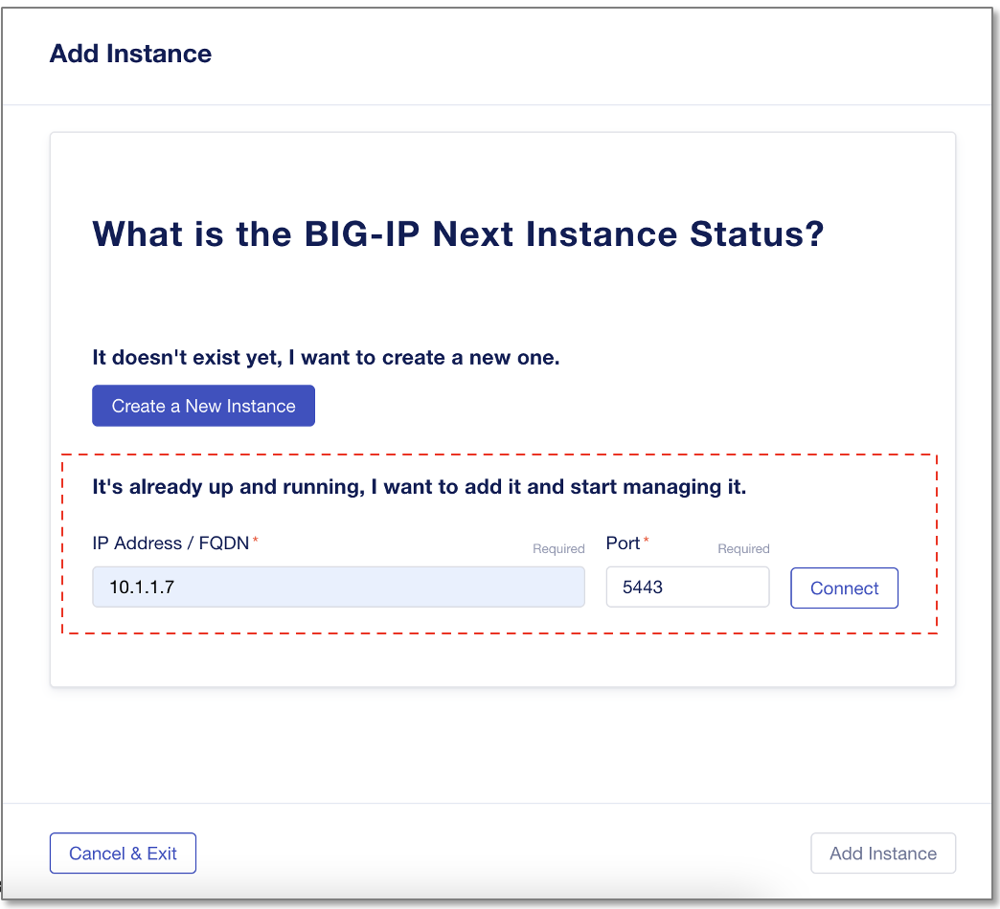

Central ManagerへのNextインスタンス登録
======================================

UDF環境からCM GUIへのアクセス
--------------------------------------

UDF画面上部タブの"DEPLOYMENT"をクリックし、BIG-IP Next Central Managerインスタンスの"ACCESS" > "GUI" を選択します。

BIG-IP Next CM GUIへのログイン
--------------------------------------

ログインプロンプトが表示されたら、ユーザ名/パスワードを入力してログインします。

- ユーザー名/パスワード:
   - **admin/Welcome123!**

ログインすると次のようなホーム画面が確認できます。

BIG-IP Next Instance1 をCMへ登録
--------------------------------------

ホーム画面の"Manage Instances"をクリックします。

|
“Start Adding Instances”をクリックします。

|
NEXTインスタンスのIPアドレスを入力します。

