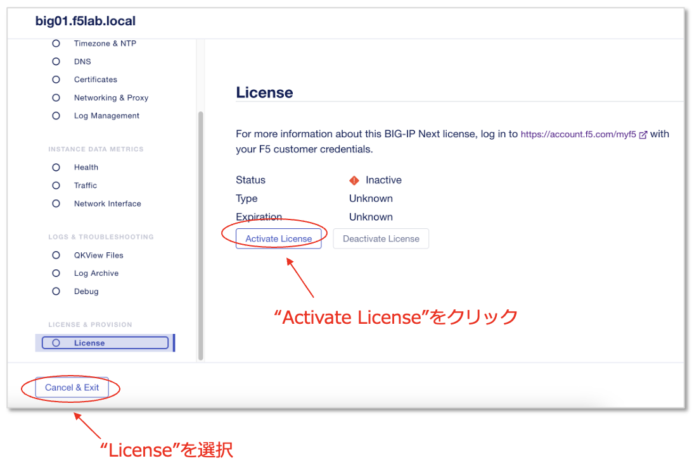

Nextインスタンス　ライセンスアクティベーション
======================================

ライセンスオーバービュー
--------------------------------------

|
- BIG-IP Nextインスタンス用のライセンスは、Central ManagerにLoadし、Central Managerがライセンス管理を行う
- Central Managerが、F5のライセンスサーバと通信を行い利用状況等をチェック
- BIG-IP Next Central Manager自体には、ライセンスは不要 (無償製品)
- 参考URL
  - https://clouddocs.f5.com/bigip-next/latest/use_cm/cm_license_bigip_next.html 

|
ライセンスの入手
--------------------------------------

MyF5よりTrialライセンス(JWTキー)を入手します。

- https://my.f5.com/

.. note::
   JWTキーのライセンスは既にCM上にインストールしているものがあります。CM上のものを使用するか、MyF5サイトから自身のアカウントで発行したライセンスを本手順に従ってインストールしてご利用ください。

"TRIALS"をクリックします。

|
"BIG-IP Next"をクリックします。

|
“Downloads and licenses”をクリックします。

|
“Copy JSON Web Token”をクリックしてテキストエディタにペーストしておくか、Downloadして保存しておきます。

|
ライセンスのインストール
--------------------------------------

BIG-IP Next CMにログインし、Infrastructure (Manage Instances)の画面で、ライセンスをアクティベーションするインスタンスをクリックします。

.. figure:: images/c5-m2-6.png
   :scale: 35%
   :align: center

|
左部メニューから **“License”** を選択し、 **“Activate License”**　をクリックします。

|
確認画面で **"Next"** をクリックします。

.. figure:: images/c5-m2-8.png
   :scale: 45%
   :align: center

|
JWTライセンスキーをNew Tokenとして登録、アクティベーションします。

.. figure:: images/c5-m2-9.png
   :scale: 40%
   :align: center

- **"New Token"** を選択
- Enter or paste the JSON Web Token(JWT)
   - 保存したJWTキーをペーストする
- Token Name:
   - **demo token** （任意の名前で可）
- **"Activate"** をクリック

.. note::
   CM上のインストール済みライセンスを利用する場合やインスタンスの追加登録の場合は **"Existing"** を選択し、"udf-lab token"を使用してください。もし、Existingトークンを使用してErrorによりInactiveのままとなってしまう場合は、一度NextインスタンスをCM上からDeleteし、Nextインスタンスのsetupを再度実行の上ライセンスアクティベーションをお試しください。

|
ライセンスのStatusが **”Active”** になっていることを確認します。

|
（参考）ライセンスアクティベート後、各モジュールのプロビジョニングが可能になります。

.. figure:: images/c5-m2-11.png
   :scale: 40%
   :align: center

この例の場合、

- WAF: 有効化済み (ポリシーが適用されているので、無効化できない)
- Access: 無効化 (有効化可能)
- DNS: 無効化 (有効化可能)
となります。
