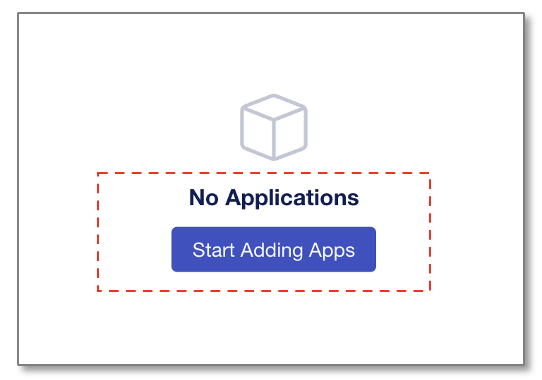
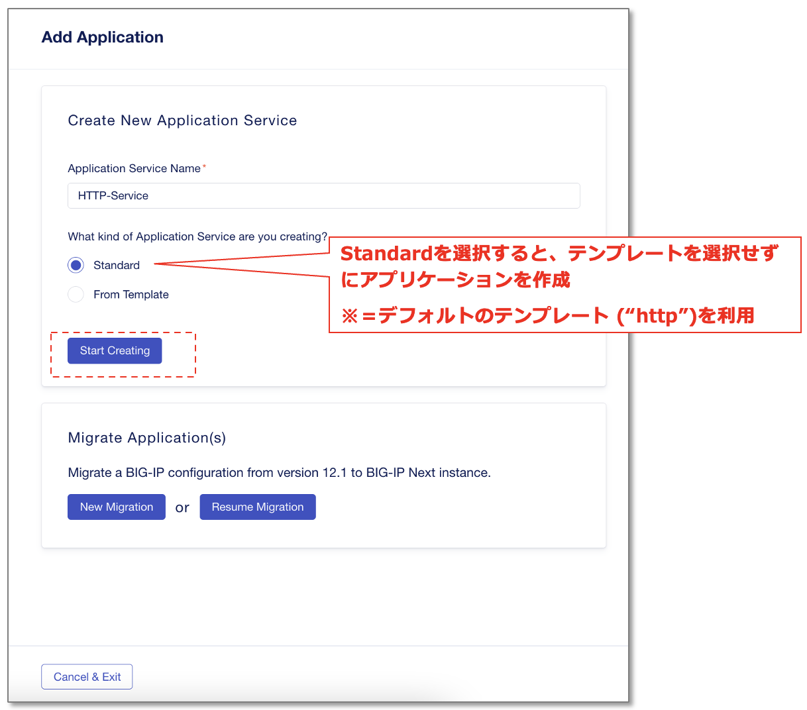
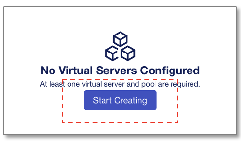
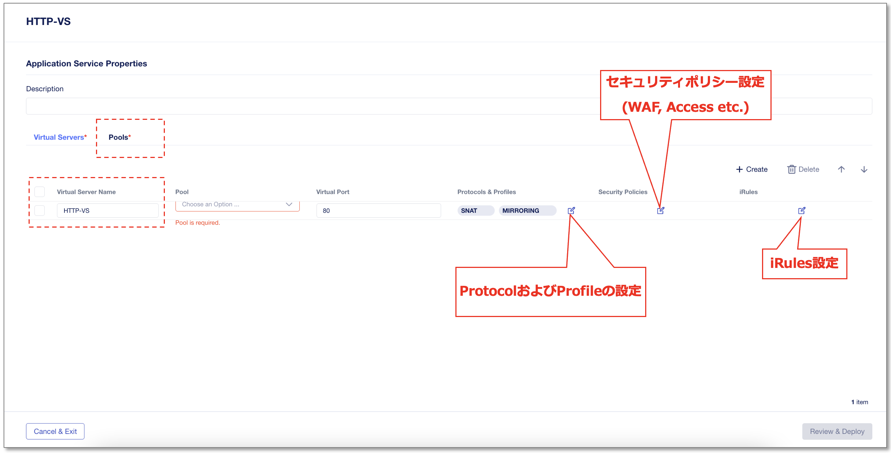
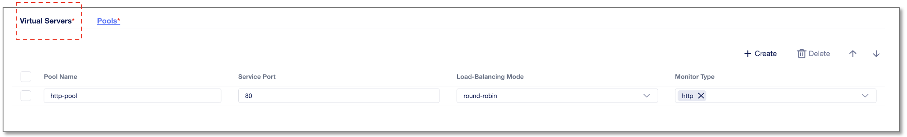
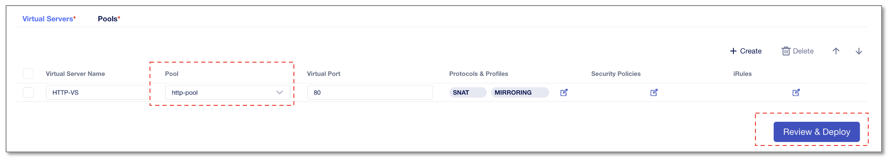
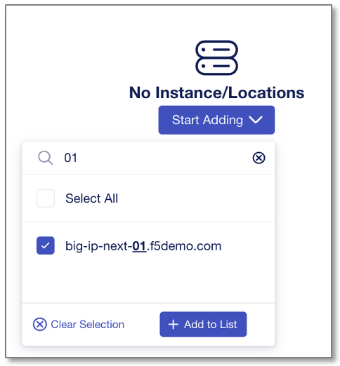

HTTPアプリケーションの設定
======================================

Standard(default “http” template)を利用したWebアプリケーションの作成
--------------------------------------

CM画面左上部のworkspaceから、”Applications”を選択します。

.. figure:: images/c6-m1-1.png
   :scale: 50%
   :align: center

|
”Start Adding Apps”をクリックします。

|
新規アプリケーション作成を開始するにあたりアプリケーション名とテンプレート選択をおこないます。

- Application Service Name:
   - **HTTP-Service**　（任意の名前）
- What kind of Application:
   - **Standard**　を選択
- **“Start Creating”** をクリック

|
次ページで表示される **“Start Creating”** をクリックします。

|
Application Service Propertiesの設定画面で、Virtual Server、Pool、Protocol Profiles等の構成を定義します。

- Virtual Server Name:
   - **HTTP-VS**
- **“Pools”** タブをクリック

|
Poolを作成します。　Pool memberのIPは後工程のアプリケーションDeploy時に設定します。

- Pool Name:
   - **http-pool**
- Server Port:
   - **80**
- Load-Balancing Mode:
   - **round-robin**
- Monitor Type:
   - **http**
- 上記設定後、再度 **”Virtual Server”** タブに戻る

|
再度Virtual Server設定で、作成したPoolを選択します。

- Pool:
   - **http-pool**　を選択
- **“Review & Deploy”** をクリック

|
次ページの“Start Adding”をクリックし、デプロイするインスタンスを選択して”+Add to List”。

- **“big01.f5lab.local”** をチェックボックスをチェックする

