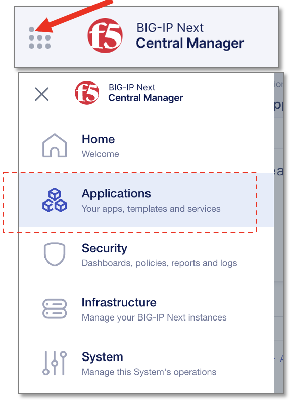

HTTPアプリケーションの設定
======================================

UDF環境からCM GUIへのアクセス
--------------------------------------

UDF画面上部タブの"DEPLOYMENT"をクリックし、BIG-IP Next Central Managerインスタンスの"ACCESS" > "GUI" を選択します。

