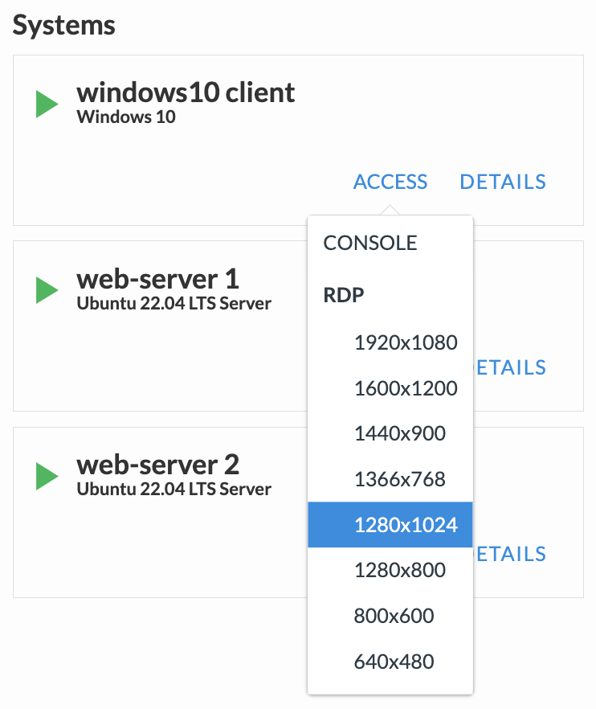

HTTPアプリケーションの通信確認
======================================

UDF環境からWindows Clientへのアクセス方法
--------------------------------------

UDF画面上部タブの"DEPLOYMENT"をクリックし、Windows Clientインスタンスの"ACCESS" > "RDP" を選択します。

Windows Clientへのログイン
--------------------------------------

ログイン画面が表示されたら、ID/パスワードを入力します。

- ユーザー名/パスワード:
   - **user/user**

