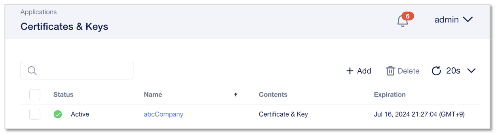

HTTPSアプリケーションの設定
======================================

HTTPS Serviceテンプレートを利用したWebアプリケーションの作成
--------------------------------------

CM画面左上部のworkspaceから、”Applications”を選択します。

.. figure:: images/c7-m1-1.png
   :scale: 50%
   :align: center

|
**”+Add Application”** をクリックします。

.. figure:: images/c7-m1-2.png
   :scale: 50%
   :align: center

|
新規アプリケーション作成を開始するにあたりアプリケーション名とテンプレート選択をおこないます。

.. figure:: images/c7-m1-3.png
   :scale: 50%
   :align: center

- Application Service Name:
   - **HTTPS-Service**　（任意の名前）
- What kind of Application:
   - **From Template**　を選択
- **“Select Template”** をクリック

|
次画面のドロップダウンメニューからテンプレートを選択します。

- Application Template:
   - **HTTPS-Load-Balancing-Service**
- **“Start Creating”** をクリック

|
Application Service Propertiesの設定画面で、Virtual Server、Pool、Protocol Profiles等の構成を定義します。
HTTPSテンプレートのデフォルト設定値が反映済み。

.. figure:: images/c7-m1-5.png
   :scale: 30%
   :align: center

（参考）ProtocolおよびHTTPS ProfileのEditマークをクリックすると、Profileのオプション設定画面が開きます。

.. figure:: images/c7-m1-6.png
   :scale: 50%
   :align: center

- Virtual Server Name:
   - **https_vs**
- Pool:
   - **my_pool**
- **“Pools”** タブをクリック

|
Poolを作成します。　Pool memberのIPは後工程のアプリケーションDeploy時に設定します。

.. figure:: images/c7-m1-7.png
   :scale: 30%
   :align: center

- Pool Name:
   - **my_pool**
- Server Port:
   - **80**
- Load-Balancing Mode:
   - **round-robin**
- Monitor Type:
   - **http**
- **”Review & Deploy”** をクリック
