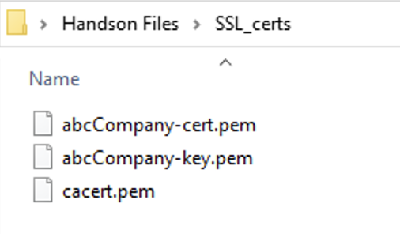

HTTPSアプリケーションの設定
======================================

HTTPS Serviceテンプレートを利用したWebアプリケーションの作成
--------------------------------------

CM画面左上部のworkspaceから、”Applications”を選択します。

|
**”+Add Application”** をクリックします。

.. figure:: images/c7-m1-2.png
   :scale: 50%
   :align: center

|
新規アプリケーション作成を開始するにあたりアプリケーション名とテンプレート選択をおこないます。

.. figure:: images/c7-m1-3.png
   :scale: 50%
   :align: center

- Application Service Name:
   - **HTTPS-Service**　（任意の名前）
- What kind of Application:
   - **From Template**　を選択
- **“Select Template”** をクリック

