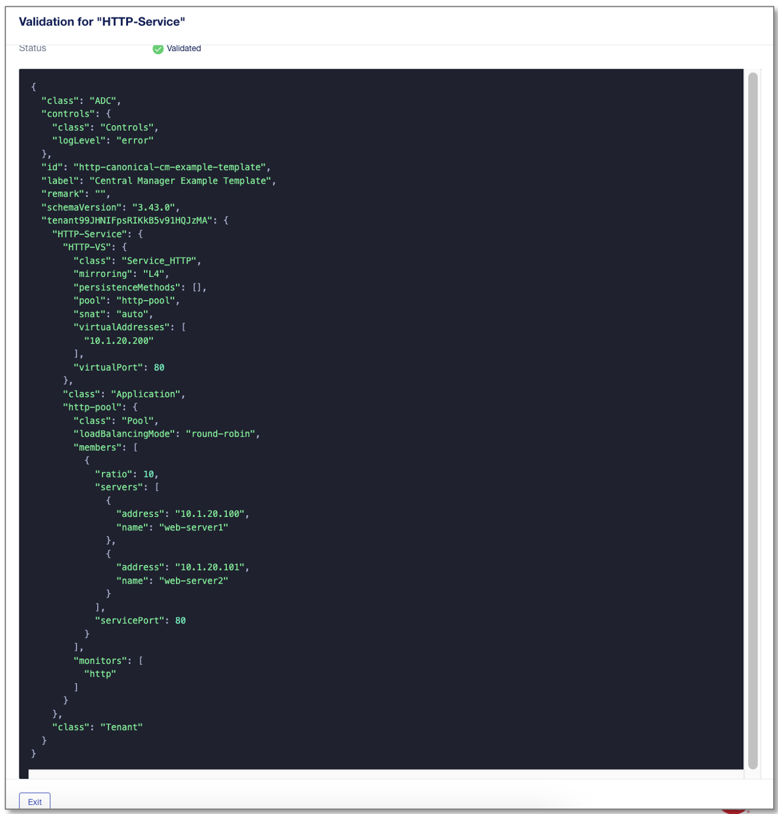
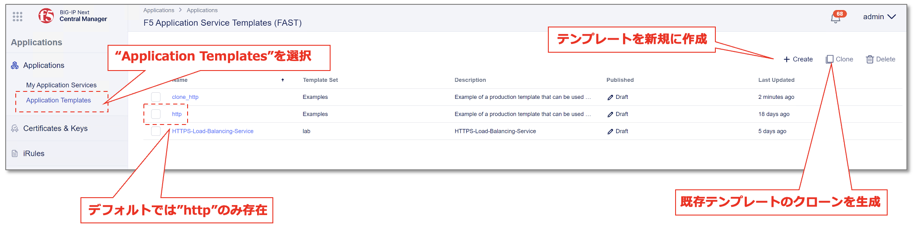
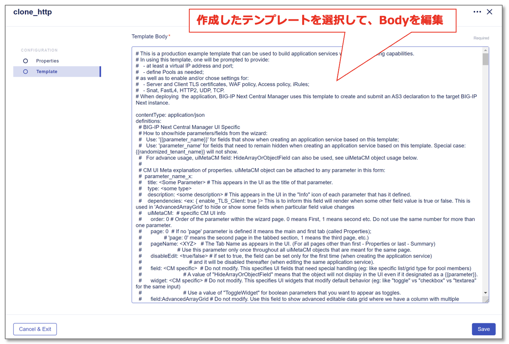

================================================
アプリケーションテンプレートのカスタマイズ
================================================

- **アプリケーションテンプレートについて**

- BIG-IP Nextでは、アプリケーションは全てCentral Managerを介したF5のAPI(AS3)で設定されます。
- GUIでの設定は、事前定義されたテンプレートに基づき、JSON/YAML形式のAS3 APIが生成されNEXTインスタンスへDeployされます。
- GUI上では未サポートの設定も多数あり、それらはテンプレート内のAPIをカスタマイズして設定する必要があります。
- サポート機能については以下Schema Reference参照

  - https://clouddocs.f5.com/bigip-next/latest/support/schema-reference.html

テンプレートの実態は以下例のようなJSON/YAML形式のコードです。

|
- **アプリケーションテンプレート作成と編集方法**

- デフォルトでは”http”テンプレートのみ存在
- デフォルトのテンプレートをコピー or 新規に作成

次章より、実際のテンプレートの編集を実施していきます。

.. toctree::
   :titlesonly:
   :caption: 目次:
   :glob:

   module**/module**
