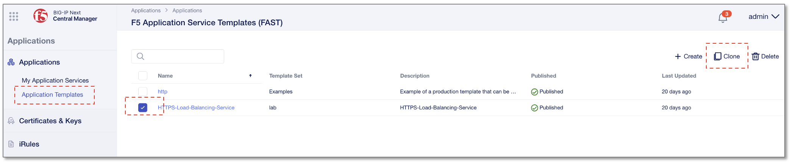

テンプレートのクローン作成
======================================

HTTPSテンプレートのクローン作成
--------------------------------------

**"Application Templates"** 画面を開き、 **”HTTPS-Load-Balancing-Service”** テンプレートのクローンを作成します。

- **”HTTPS-Load-Balancing-Service”** のチェックボックスをチェック
- 右上の **”Clone”** をクリック

HTTPテンプレートのクローン作成
--------------------------------------

