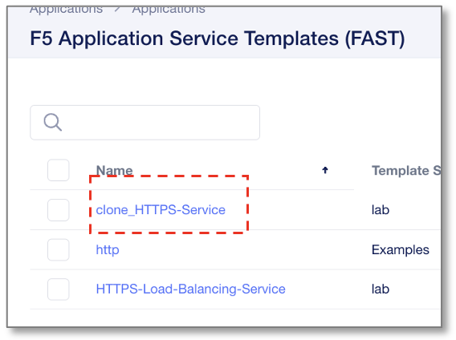
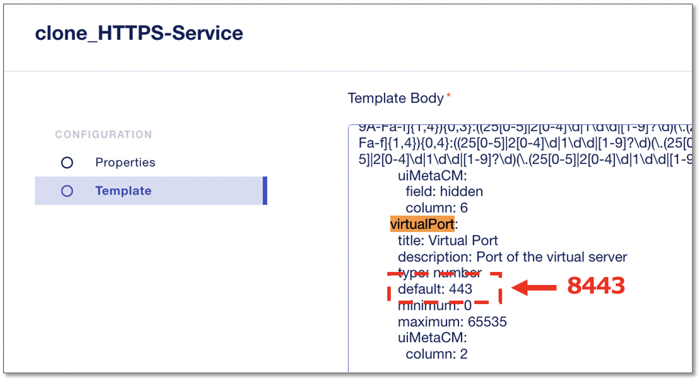
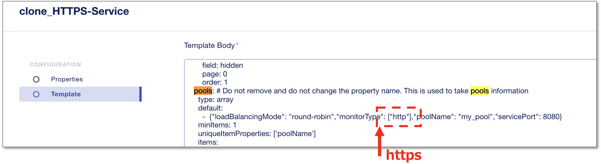

HTTPS Virtual Serverのカスタマイズ
======================================

Virtual Serverの各種デフォルトの設定値を変更します。
作成したクローン **clone_HTTPS-Service** をクリックします。

Virtual Server Portを443から8443へ変更
--------------------------------------

Template Bodyの中の、defaultポート番号設定の箇所を **”443”** から **”8443”** に編集します。
※ **virtualport** や **443** 等の文字列でブラウザ文字検索すると該当箇所を簡単に見つけることができます。

|
default Monitor typeをhttpからhttpsへ変更
--------------------------------------

Template Bodyの中の、Monitor Typeを **”http”** から **”https”** に編集します。
※ **pools** 等の文字列でブラウザ文字検索すると該当箇所を簡単に見つけることができます。

