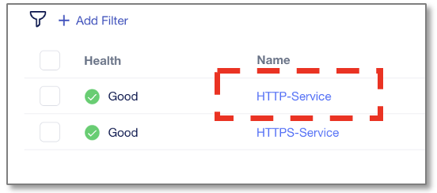

TCP Profileのカスタマイズ
======================================

TCP Profileをカスタマイズし、設定項目を追加します。
先に現状のテンプレート内容を確認します。

|
変更前の状態確認
--------------------------------------

作成済みのアプリケーション”HTTP-Service”を開き、右上の”Edit”マークをクリックします。

