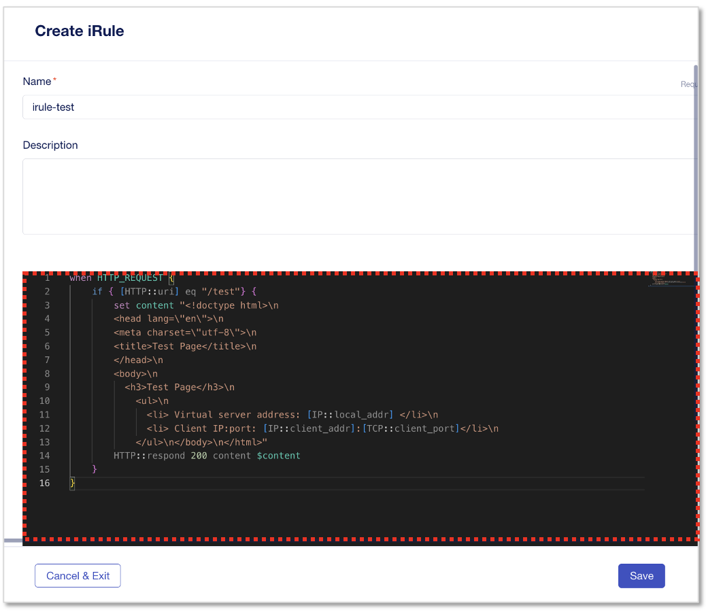

iRuleの作成
======================================

「HTTPリクエストの特定のURI path(/test)の場合、任意のコンテンツを返す」 内容のiRuleを作成していきます。

iRule作成
--------------------------------------

CM画面左上部のworkspaceから、”Applications”を選択します。

.. figure:: images/c9-m1-1.png
   :scale: 50%
   :align: center

|
左メニューから **”iRules”** を選択し、右上の **”+ Create”** をクリックします。

.. figure:: images/c9-m1-2.png
   :scale: 50%
   :align: center

|
次のiRuleスクリプトを、iRule設定画面にコピー＆ペーストします。

.. code-block:: cmdin

|　 when HTTP_REQUEST {
|　    #log local0. "path: [HTTP::uri]"
|　    HTTP::header insert X-Forwarded-For [IP::remote_addr]
|　    if { [HTTP::uri] eq "/test"} {
|　        HTTP::respond 200 content {
|　            <!doctype html>
|　                <head lang="en">
|　                <meta charset="utf-8">
|　                <title>Test Page</title>
|　　           </head>
|　           <body>
|　               <h3>Test Page</h3>
|　　           </body>
|　　           </html>
|　　       }
| 　　   }
|　　}

|
- 作成するiRuleのスクリプト内容

  - HTTP Requestイベント時
  - IP情報をXFFヘッダに挿入
  - URI Path "/test" へのアクセスの場合、“Test Page”のhtmlコンテンツとステータスコード200をレスポンスする

|

- Name:
   - **irule-test**
- 上記赤枠のフィールドに前ページのiRuleをコピーペーストし、 **”Save”** をクリック
