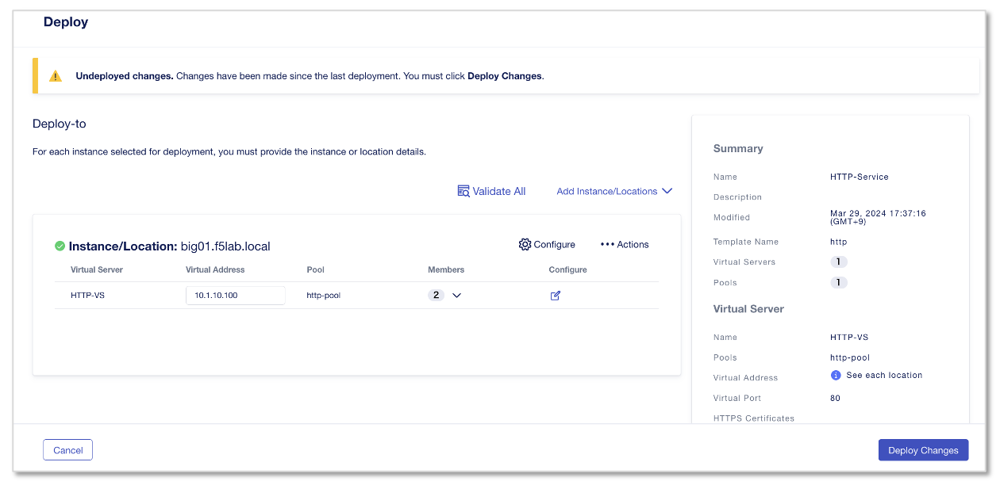
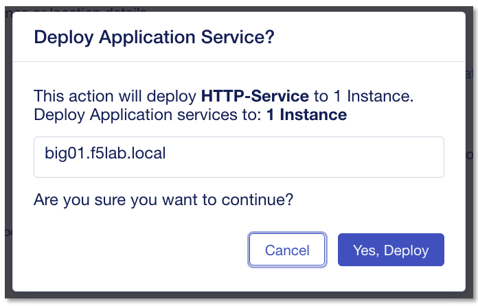

iRuleの作成
======================================

「HTTPリクエストの特定のURI path(/test)の場合、任意のコンテンツを返す」 内容のiRuleを作成していきます。

iRule作成
--------------------------------------

CM画面左上部のworkspaceから、”Applications”を選択します。

.. figure:: images/c9-m1-1.png
   :scale: 50%
   :align: center

|
左メニューから **”iRules”** を選択し、右上の **”+ Create”** をクリックします。

.. figure:: images/c9-m1-2.png
   :scale: 50%
   :align: center

|
次のiRuleスクリプトを、iRule設定画面にコピー＆ペーストします。

.. code-block:: cmdin

    when HTTP_REQUEST {
       log local0. "path: [HTTP::uri]"
       HTTP::header insert X-Forwarded-For [IP::remote_addr]  #IP情報をXFFヘッダに挿入
       if { [HTTP::uri] eq "/test"} {                         #URI /test の条件文に該当する場合
           HTTP::respond 200 content {                        #以下HTMLコンテンツを返す
               <!doctype html>
                   <head lang="en">
                   <meta charset="utf-8">
                   <title>Test Page</title>
               </head>
              <body>
                  <h3>Test Page</h3>
               </body>
               </html>
           }
    　   }
    }

|

- 作成するiRuleのスクリプト内容

  - HTTP Requestイベント時
  - IP情報をXFFヘッダに挿入
  - URI Path "/test" へのアクセスの場合、“Test Page”のhtmlコンテンツとステータスコード200をレスポンスする

|
.. figure:: images/c9-m1-3.png
   :scale: 40%
   :align: center

- Name:
   - **irule-test**
- 上記赤枠のフィールドに前ページのiRuleをコピーペーストし、 **”Save”** をクリック

|
アプリケーションへの適用
--------------------------------------

My Application Servicesから作成済みの”HTTP-Service”をクリックします。

|
次画面右上の”Edit”をクリックします。

.. figure:: images/c9-m1-5.png
   :scale: 50%
   :align: center

|
iRuleの"Edit"ボタンをクリックします。

|
“Use iRules”のトグルをEnableにし、”Add”をクリックします。

|
作成した”irule-test”のチェックボックスをクリックし”Add”をクリックします。

元画面で **"Save"** をクリックし、　**”Review & Deploy"** をクリックします。

|
次のDeploy画面で、 **"Deploy Changes"** をクリックします。

|
 **"Yes, Deploy"** をクリックします。

|
クライアントからサーバへの通信確認を行います。 Windows clientのブラウザから
 **http://10.1.10.100/test**　のURLへアクセスを試行します。

.. figure:: images/c9-m1-11.png
   :scale: 50%
   :align: center

"Test Page" の画面が表示されれば、iRuleによりコンテンツをレスポンスしていることになります。

