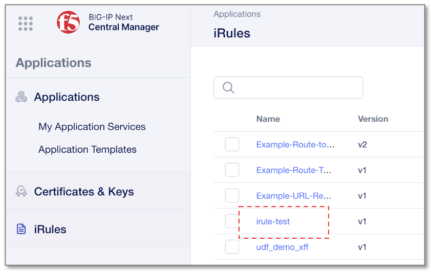
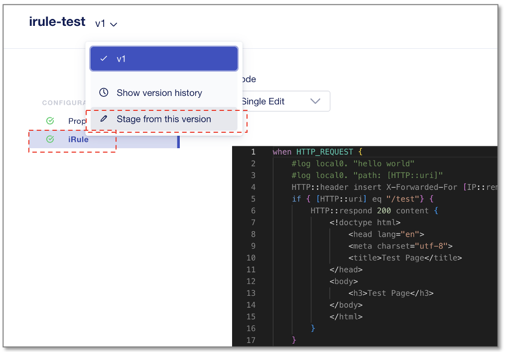
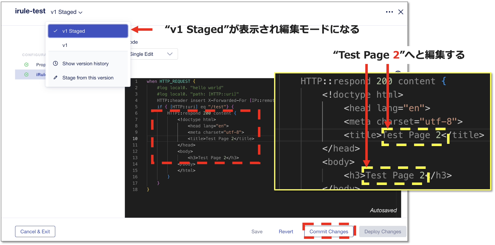
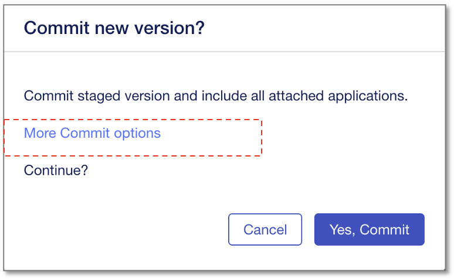
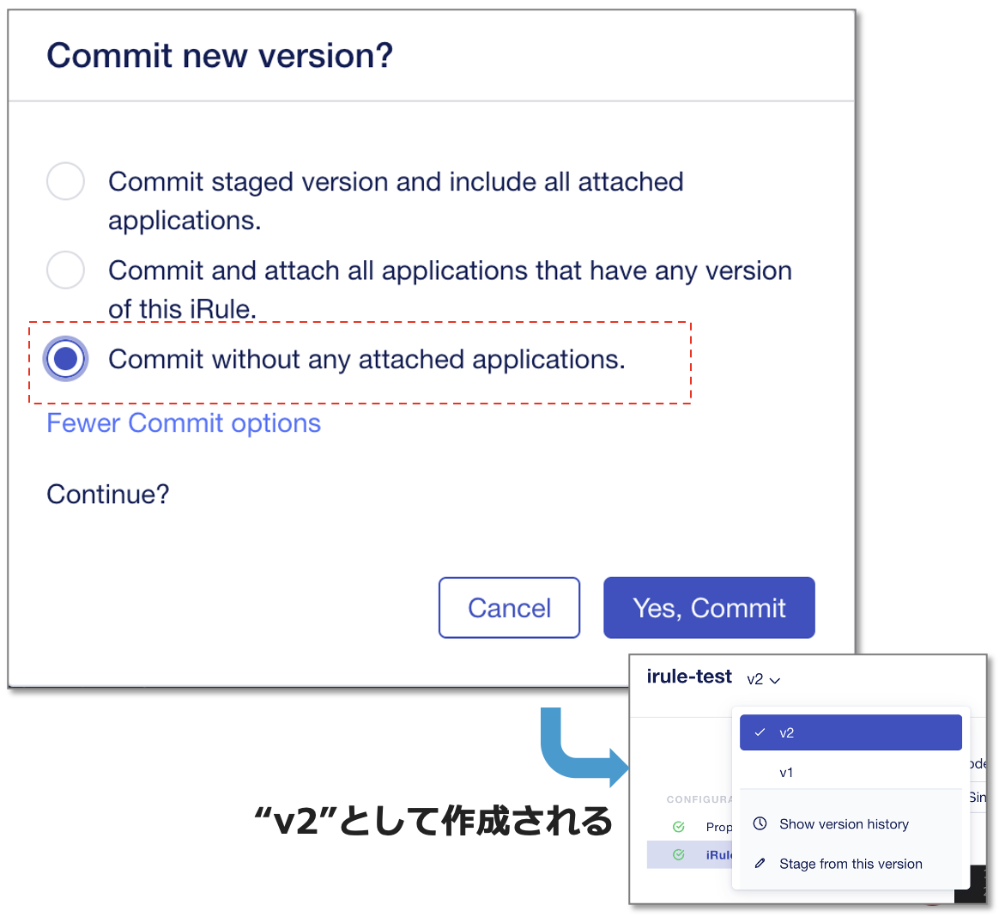

iRuleの変更とバージョニング
======================================

iRuleを部分編集し、履歴管理の機能を確認します。

iRuleの変更
--------------------------------------

作成した”irule-test”をクリックします。

|
メニューから作成した”irule-test”をクリックし、上部”v1”のドロップダウンメニューから“Stage from this version”を選択します。

|
すると、“v1 Staged”が表示され編集モードになります。
HTMLコンテンツ内容を、"Test Page"から **"Test Page 2"** へと編集します。

編集後、 **”Commit Changes”** をクリックします。

|
次の確認画面にて、 **“More Commit options”** をクリックしてオプション画面を開きます。

|
更新後のiRuleが関連アプリケーションで直ちに有効にならないように、 **“Commit without any attached applications”** を選択し、“Yes, Commit”をクリックします。

すると、更新版の **"v2"** として作成されます。
