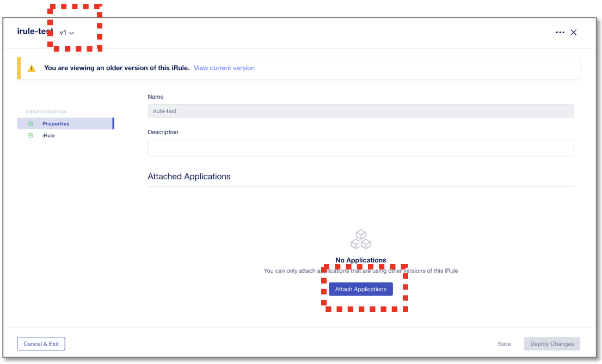
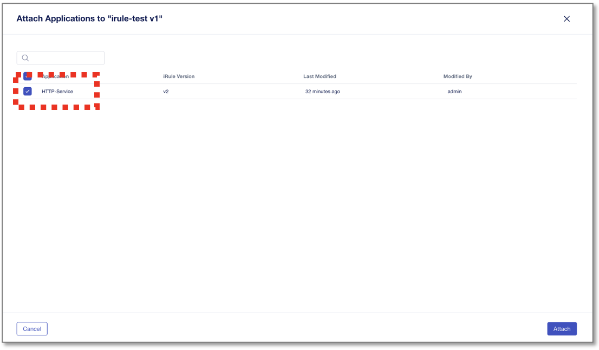
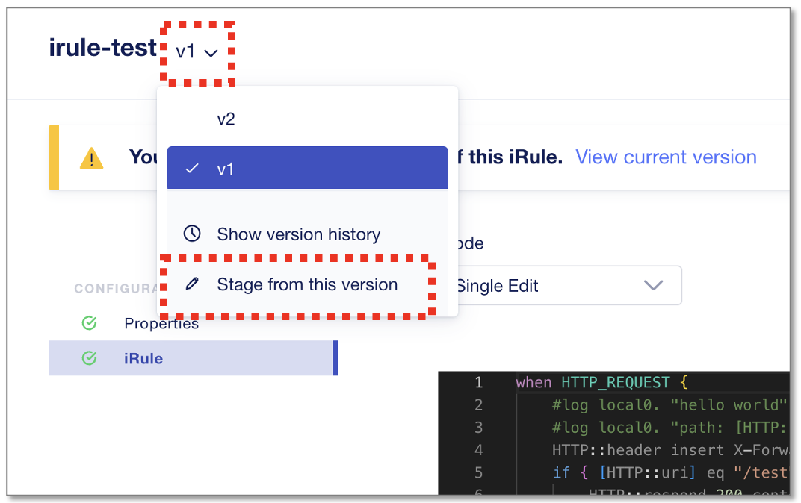
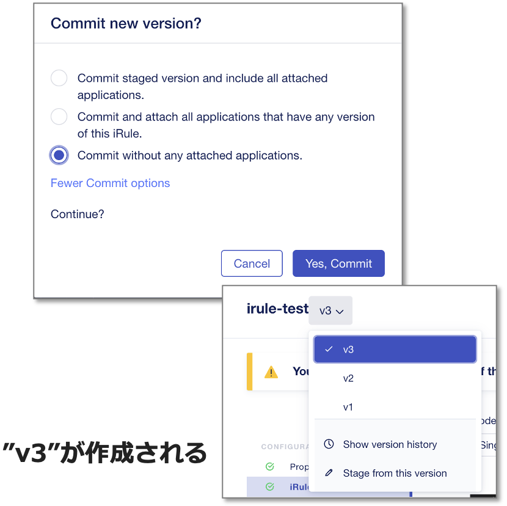

iRuleのロールバック
======================================

iRuleを、旧バージョンの以前の設定に戻す方法を確認します。
戻し方の考え方は２通りあり、
・“v1”ルールを充て直す
・“v1”ルールをコピーして”v3”として充て直す

どちらを採択すべきかは運用状況によりますが、手順的にはいずれも大差はありません。

v1ルールの充て直し
--------------------------------------

“irule-test”の”v1”を選択し、“Attach Applications”をクリックします。

|
現状”v2”が適用されているHTTP-Serviceをチェックして"Apply"、“Deploy Changes”をクリックします。

以上で"v1" iRuleへのロールバックは完了です。

|
v3ルールとして充て直し
--------------------------------------

旧iRuleに戻す際、履歴バージョンをv3としてリビジョンアップして適用し直します。

以前の”v1”の状態で”Stage from this version”を選択し、“Commit Changes”をクリックします。

|
”More Commit Option”から”Commit without any attached applications”を選択し、”Yes, Commit”をクリックします。
すると同一iRuleが"v3"として作成されます。

