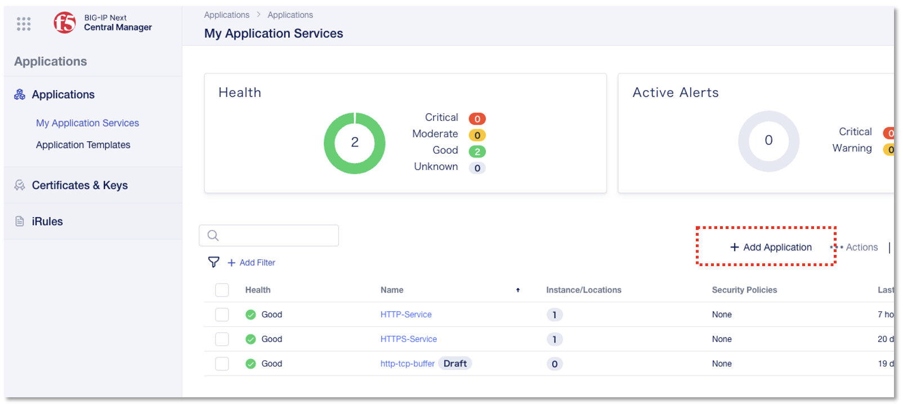
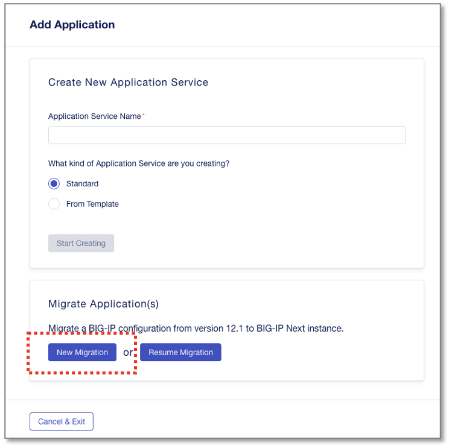
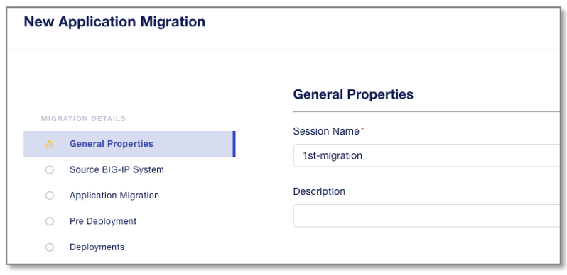
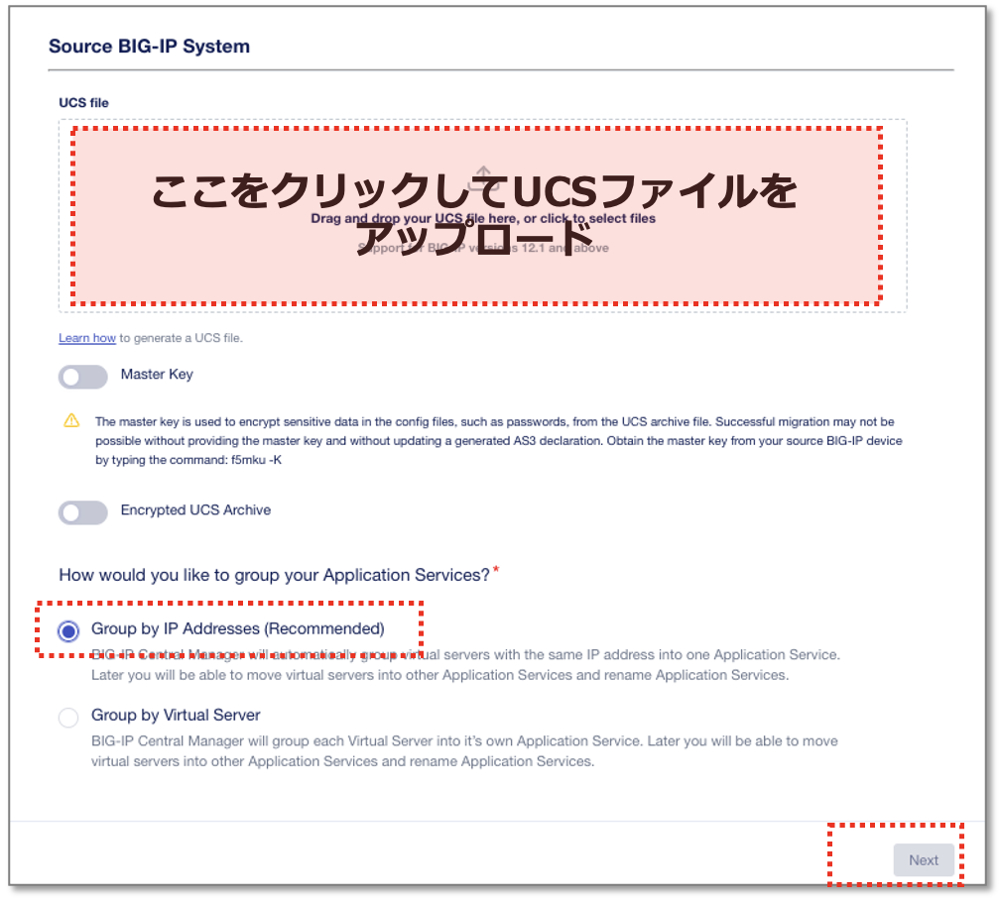

Central ManagerへUCSファイルをインポート
======================================

**"Application Templates"** 画面を開き、
My Application Servicesの画面から **”+ Add Application”** をクリックし、次画面で **”New Migration”** を選択します。

|
General Properties画面で、Migration Session名とDescriptionを設定します。

- Session Name:
   - **my-1st-migration** (任意の名前)
- **"Next"** をクリック

|
CMへアップロードするUCSファイルを選択します。

- 赤枠部分をクリックし、UCSファイルを選択します。
- **“Group by IP Addrss”** を選択
- **"Next"** をクリック

