設定マイグレーションの実行
======================================

UCSからインポートしたアプリケーションをNextインスタンスへデプロイします。

|
ステータスがグリーンのApplicationを選択して **"Add"** をクリックします。

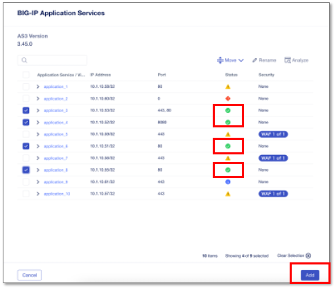

|
**"Next"** をクリックします。

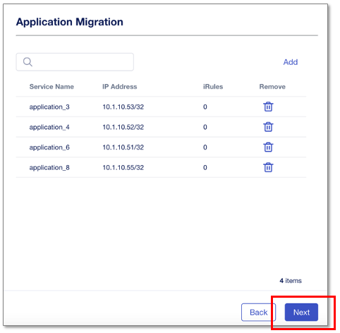

|
“Shared Objects”(iRule、証明書等の共通項目)の **"import"** をクリックしてCMに取り込んだ後、 **”Deploy”** をクリックします。

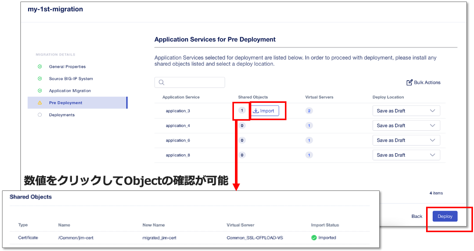

|
正常にSuccessfulでDeployされたら **”Finish”** をクリックして閉じます。

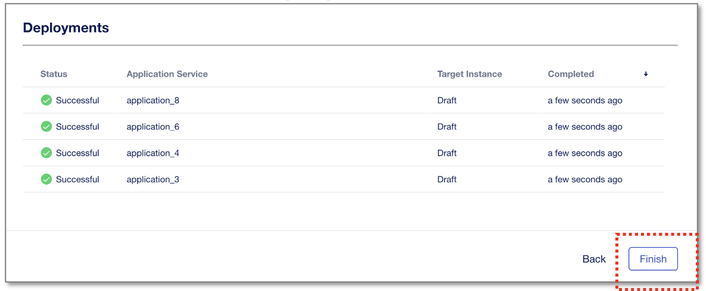

|
My Application Servicesを見ると、Draftとして(instanceへの割り当てなし)Applicationが作成されています。

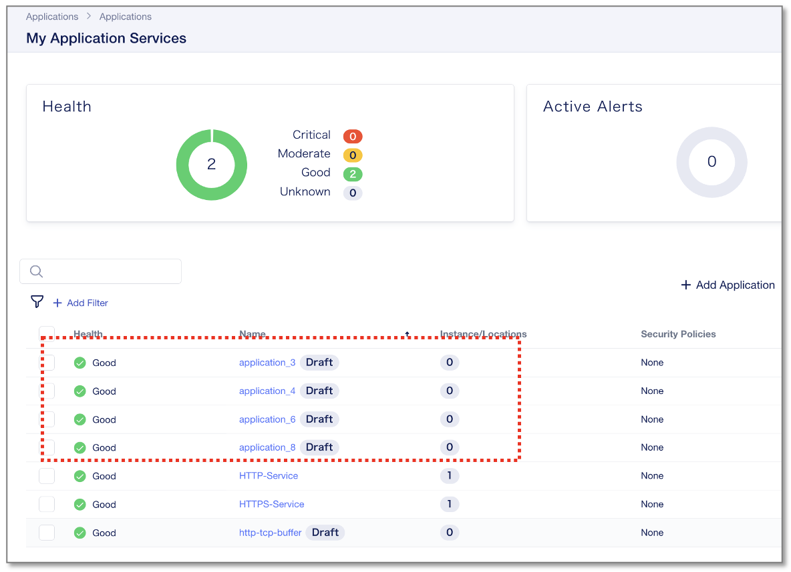

|
（参考）実運用では、通信切り替え前にアドレス重複を避けるために、既存TMOSのVirtual Serverを先にDisableします。

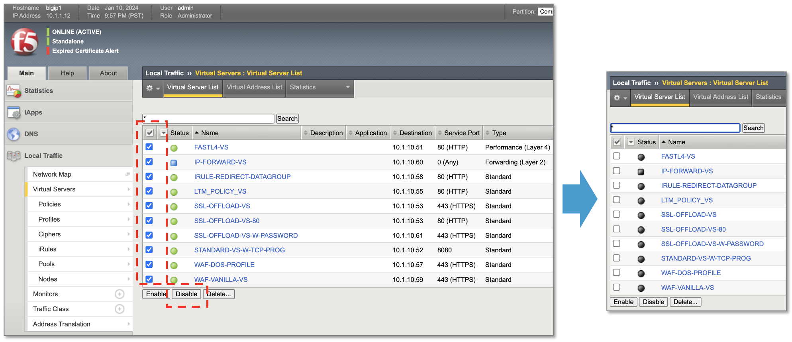

|
DeployするApplication **"application_3"** をクリックします。

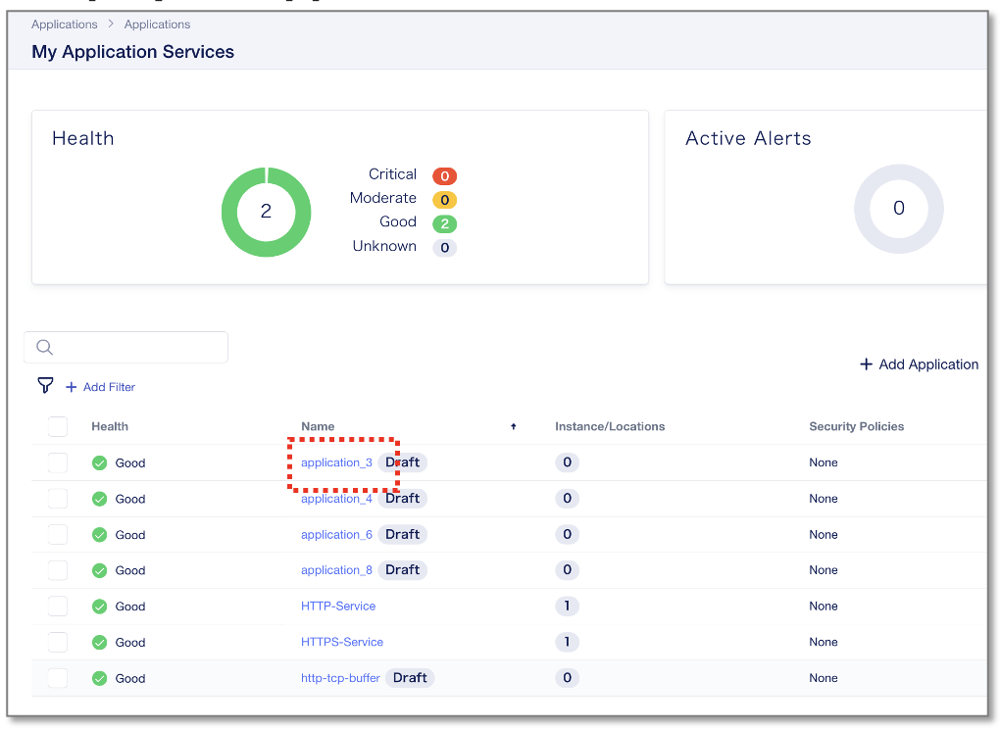

|
**“Save & Deploy”** をクリックします。

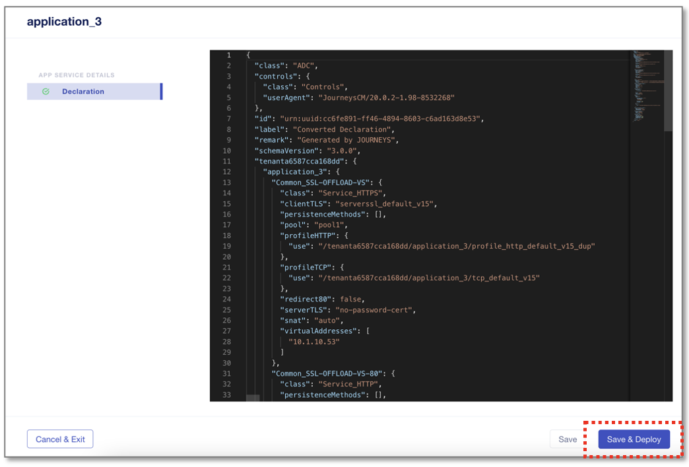

|
アプリケーションをデプロイするNextインスタンスを選択します。

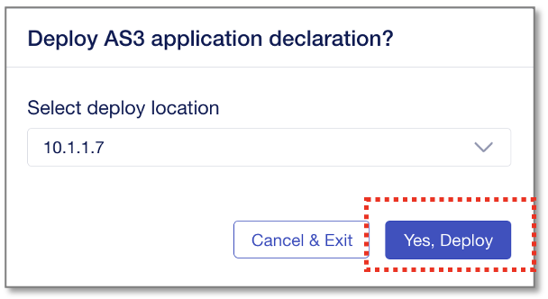

- Select Deploy Location:
  - **"10.1.1.7"**
- **“Yes, Deploy”** をクリック

|
Instance/Locationsが "1"と表示されるようになり、1インスタンスへデプロイされています。

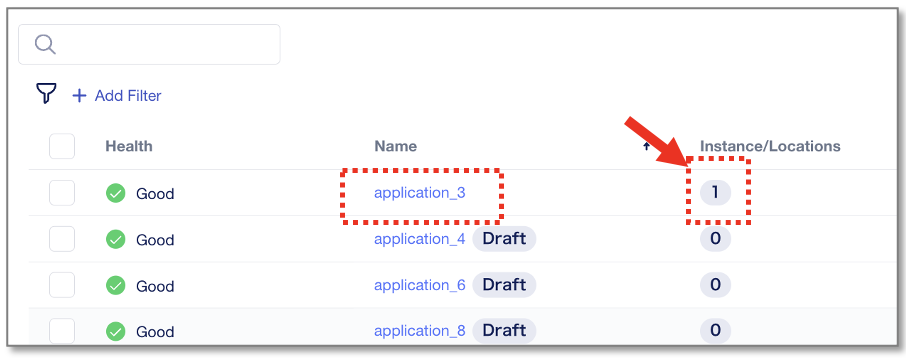

|
デプロイしたApplicationをクリックすると、指定したInstanceで正常に動作していることが確認できます。

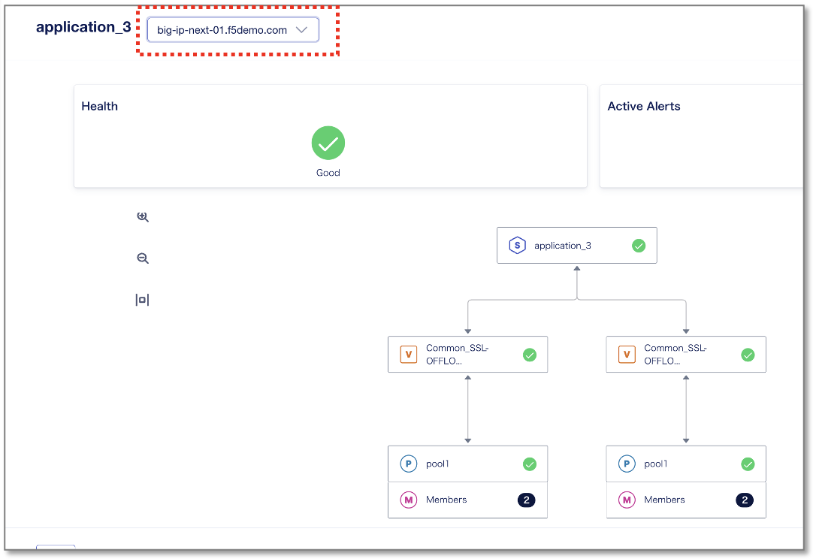

