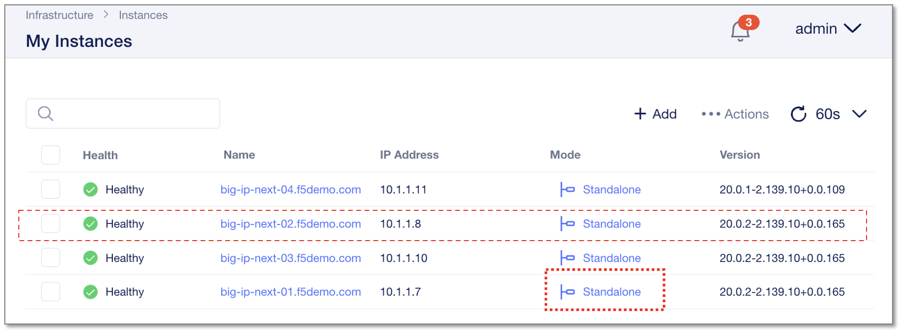
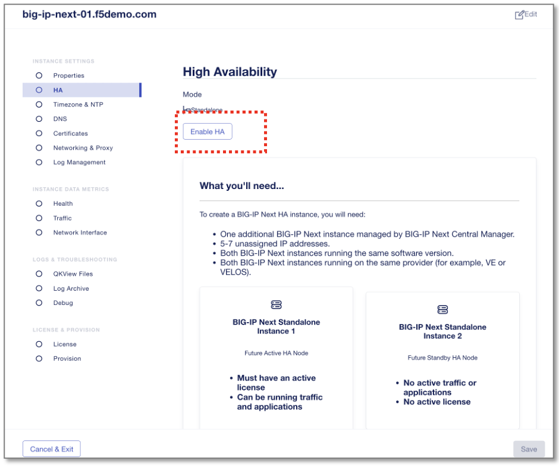
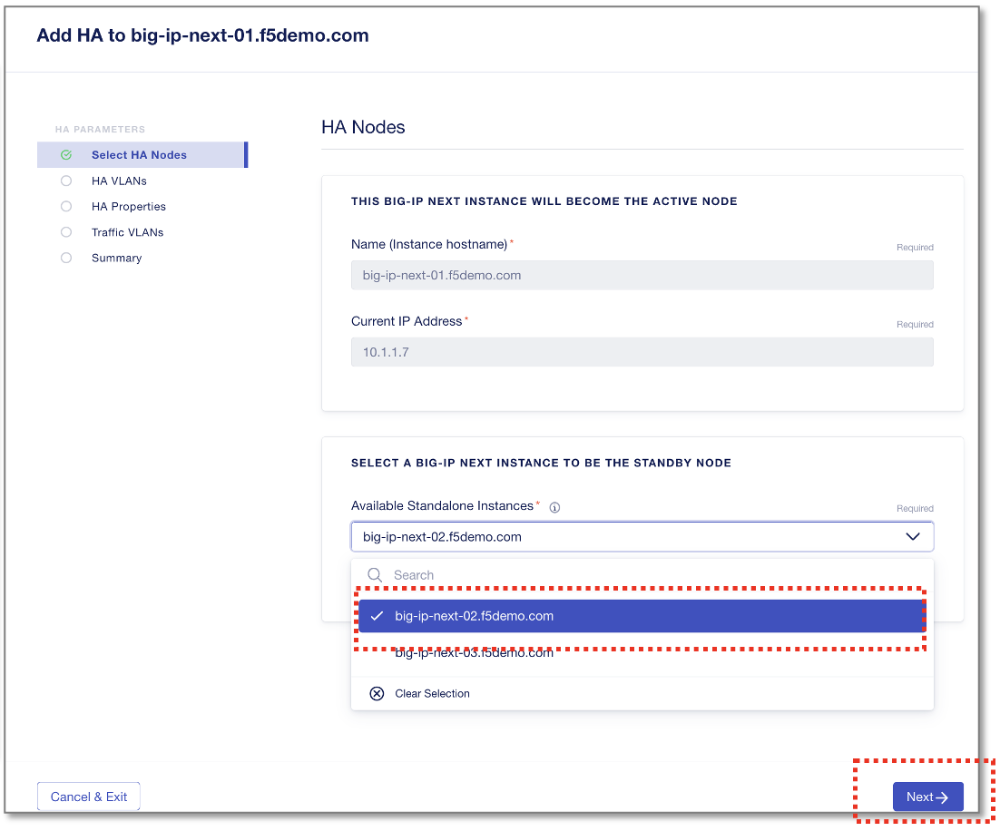
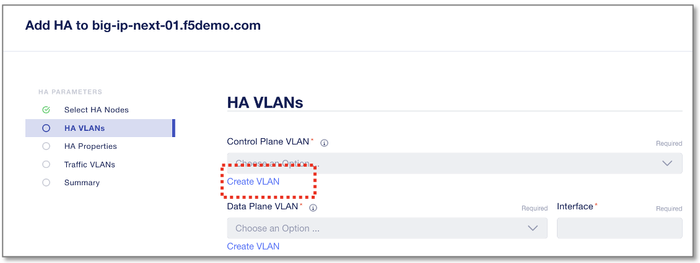
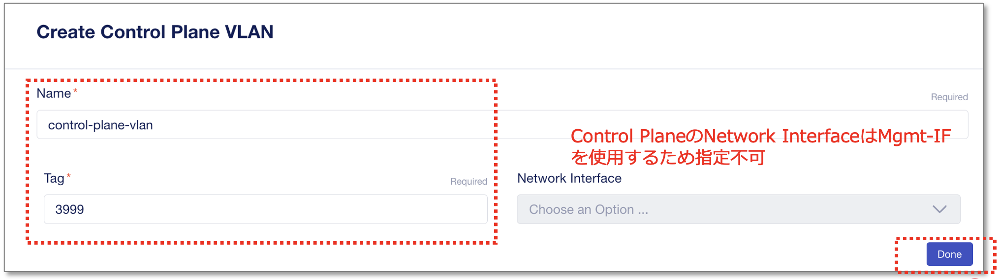
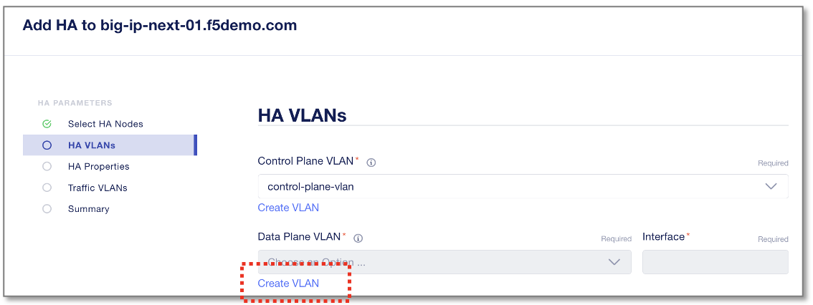
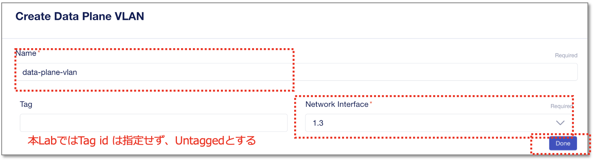
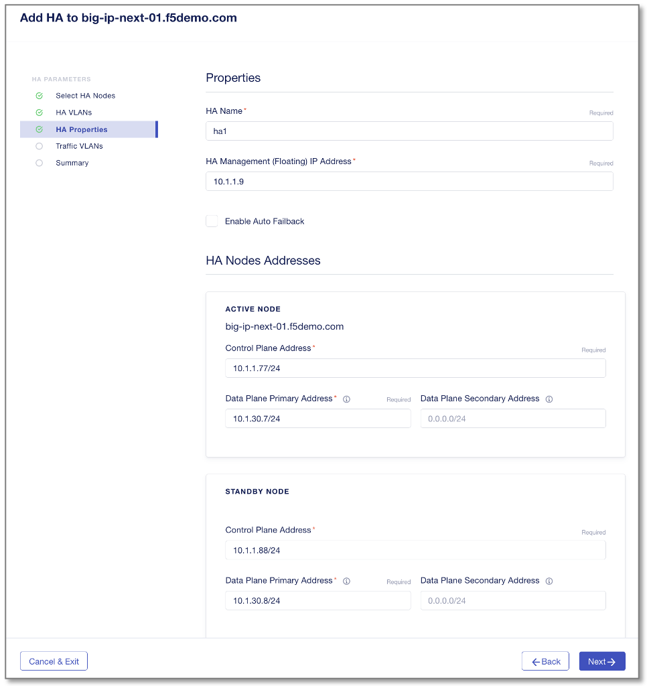

HAクラスタのセットアップ
======================================

HAクラスタを設定していきます。
HA Active機とするBIG-IP Nextインスタンス#1(10.1.1.7)のMode “Standalone”をクリックします。

|
左メニューからHAを選択し、 **”Enable HA”** をクリックします。

|
ドロップダウンからStandbyノードを選択します。

- Available Standalone Instances:
   - **big02.f5lab.local**
- **”Next”** をクリック

|
**HA Control Plane VLAN** を設定します。
Control Plane VLAN新規作成のための **”Create VLAN”** をクリックします。

|
VLANの設定情報を入力します。

- Name:
   - **control-plane-vlan**
- Tag:
   - **3999**
- **”Done”** をクリック

|
**HA Data Plane VLAN** を設定します。
Data Plane VLAN新規作成のための **”Create VLAN”** をクリックします。

|
VLANの設定情報を入力します。

- Name:
   - **data-plane-vlan**
- Network Interface:
   - **1.3**
- **”Done”** をクリック
- 次画面の **”Next”** をクリック

|
HA Propertiesを設定します。

- HA Name:
   - **ha1**
- HA Management(Floating) IP Address:
   - **10.1.1.9**

*Active Node*

- Control Plane Address:
   - **10.1.1.77/24**
- Data Plane Primary Address:
   - **10.1.30.7/24**

*Standby Node*

- Control Plane Address:
   - **10.1.1.88/24**
- Data Plane Primary Address:
   - **10.1.30.8/24**
|
- **”Next”** をクリック
