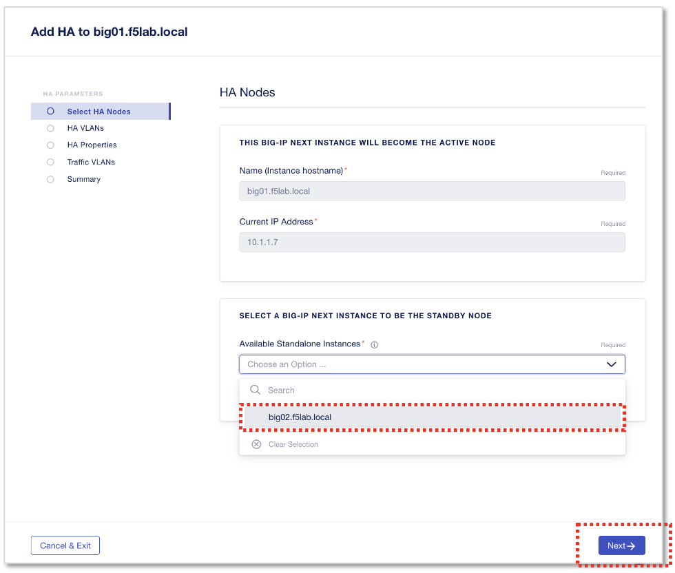

HAクラスタのセットアップ
======================================

HAクラスタを設定していきます。
HA Active機とするBIG-IP Nextインスタンス#1(10.1.1.7)のMode “Standalone”をクリックします。

.. figure:: images/c11-m2-1.png
   :scale: 40%
   :align: center

|
左メニューからHAを選択し、 **”Enable HA”** をクリックします。

.. figure:: images/c11-m2-2.png
   :scale: 50%
   :align: center

|
ドロップダウンからStandbyノードを選択します。

- Available Standalone Instances:
   - **big02.f5lab.local**
- **”Next”** をクリック

