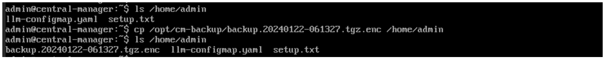

Central Managerのリストア
======================================

バックアップ作成時と同様にCLIセッションで作業が必要となります。
作成されたファイルを、secure location(/opt/cm-backup/)から任意のディレクトリにコピーします。

.. code-block:: cmdin

 例）
 cp /opt/cm-backup/backup.20240122-061327.tgz.enc /home/admin 

